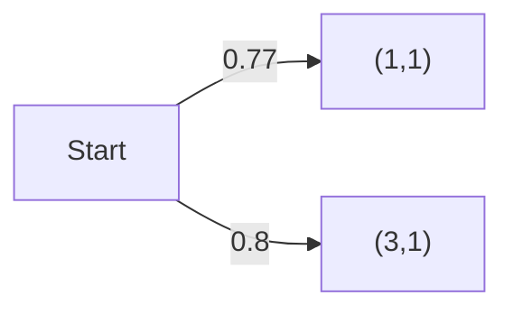
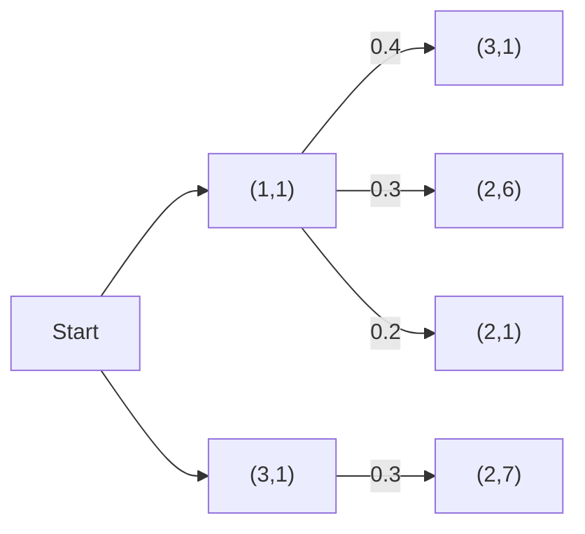
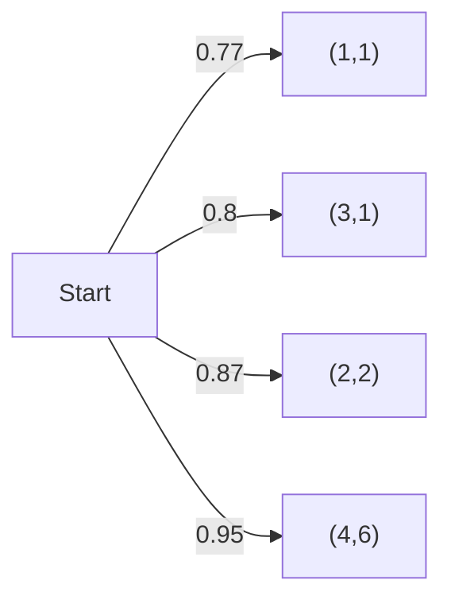
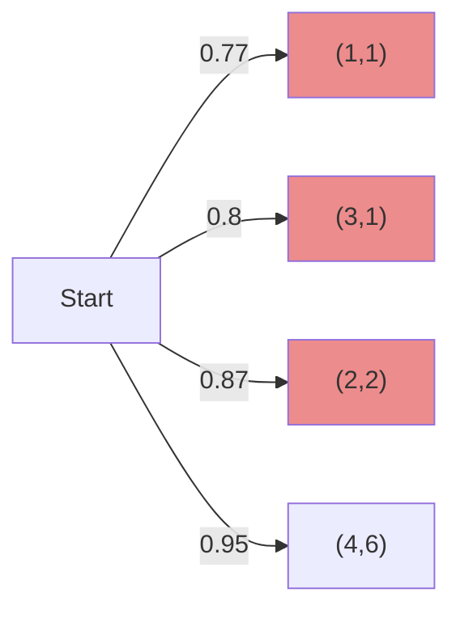
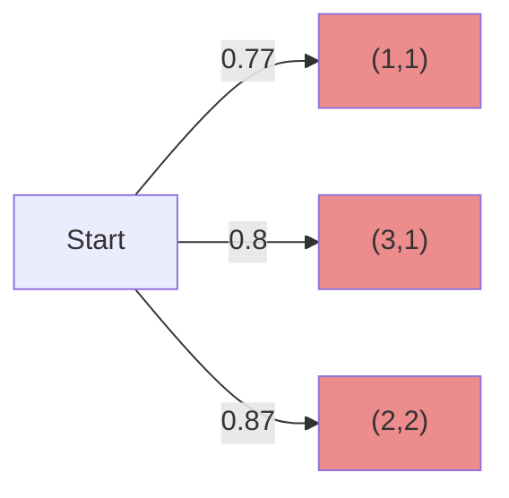
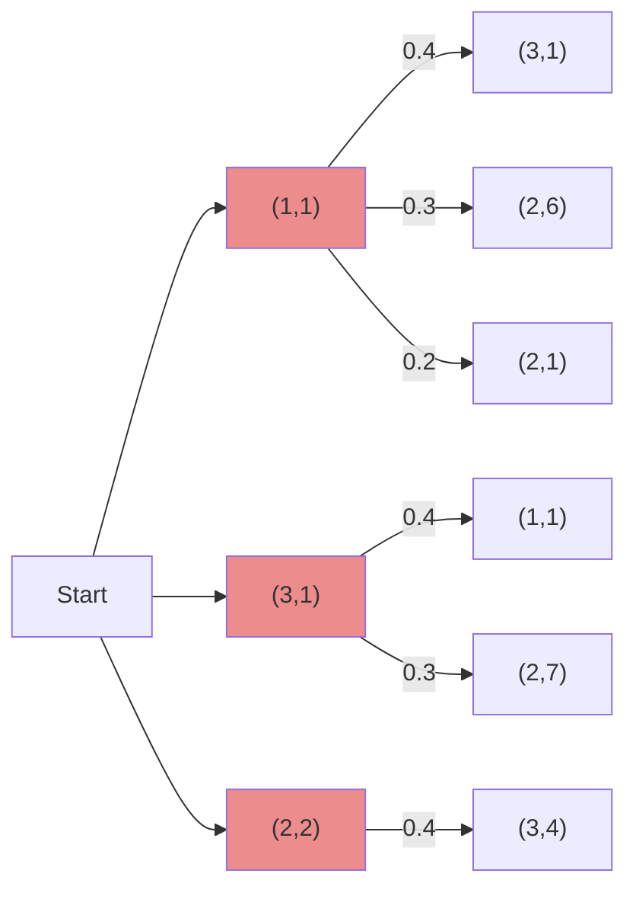
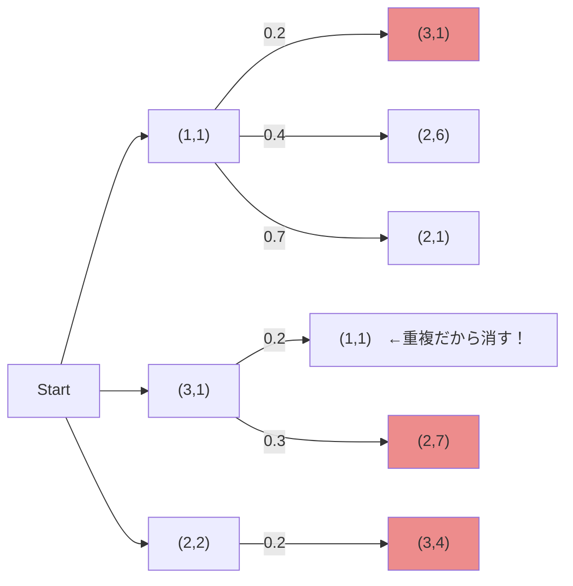
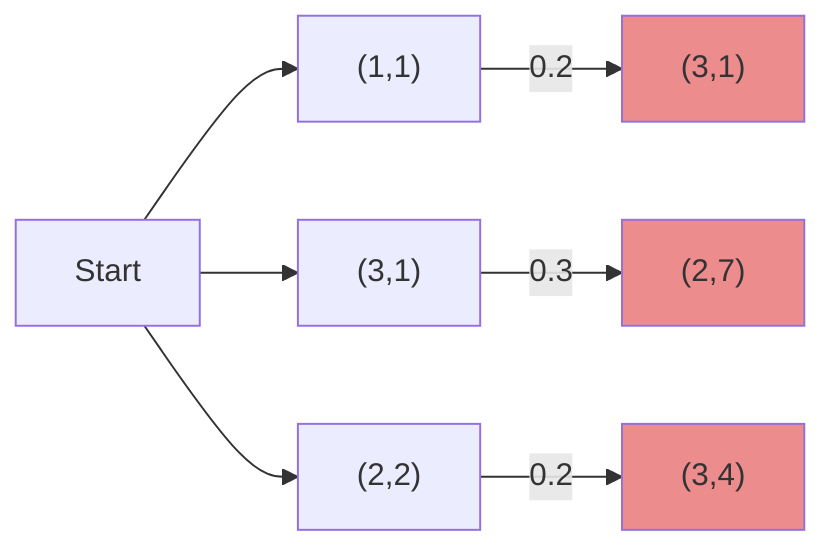
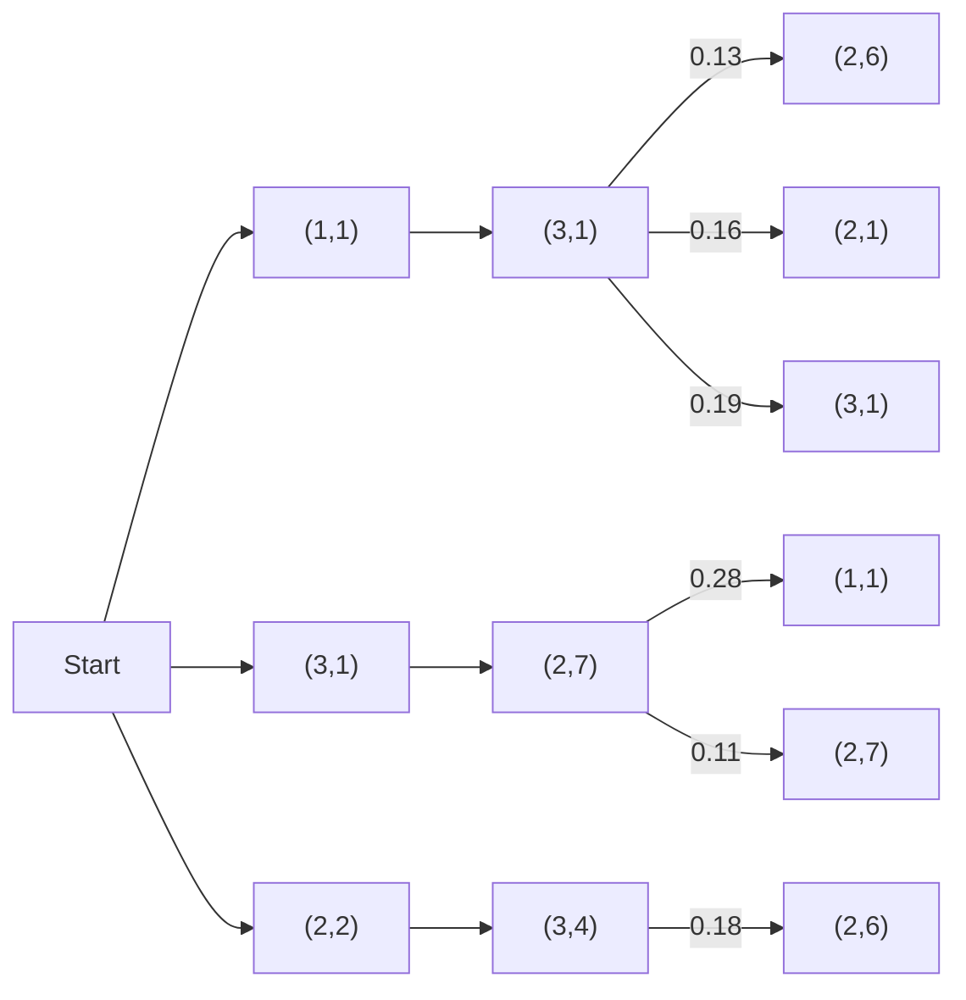
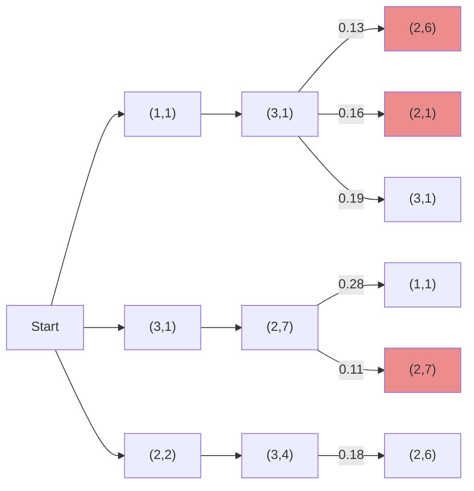

# 2023年秋 ゼミ発表

#### 研究進捗報告

#### 情報通信学科 M0 鶴岡 豪

<!--

-->

---

# 目次

1. 研究テーマについて
2. 論文の提出方針
3. 論文の構成について
4. 今後の方針

---

# お願い

<!-- - ページ数が多いです(すみません...) -->
- 今日はこれから話す以下の内容がメイン
  - CSSの論文の構成と改善点
  - 改善点を踏まえた国際学会への論文構成

 
  

以下の内容をコメントシートにたくさん書いてほしい

- 論文構成・論証・議論の流れについて
  - 疑問点
  - 不備がありそうな点

---
layout: cover
---
 
 

# 研究テーマについて　

## 夜にのみ有効な敵対的反射パッチ

---

# CSSでの研究テーマについて(Review)

## テーマ : 夜にのみ有効な敵対的反射パッチ

- 再帰反射パッチを使ってYOLOv3-tinyの検知回避を狙う
- 鍵 : 夜の環境で，簡単かつ安価な攻撃
- 脅威モデル: 交差点での衝突
- ディジタル・物理の両面で評価

---

# 物体検知とその回避について(Review)

YOLOなどの物体検知モデルは以下を予測

1. 物体の位置
2. 物体のクラス
3. 信頼度

信頼度: しきい値がある

→閾値以下であると物体が存在しないと扱う

→閾値以下にするようにノイズを加えれば検知回避ができる

---

# 具体的なパッチの貼り方(Review)

- 物体が存在する信頼度を下げるように貼る
  - 信頼度はYOLOの出力より得られる
  - 0から1の値．確率
- 貼り方の決定→グリッドで区切って，貼る位置を探索
  - パッチの大きさ固定
  - 貼る位置の候補:予め定めてある
  - →効率的な探索方法で探す(ビームサーチ)

<!--画像を 中央に -->

<figcaption>グリッド状に区切るイメージ</figcaption>

---

# ビームサーチ

#### ビームサーチ : 上位b個の候補を保持しながら、次の貼る位置を探索

→精度と計算量のバランスが良い

例: 50個から5つ選んでパッチを貼る．
 
目的: 5つのパッチの組み合わせで，一番信頼度が下がるものを選びたい

**ビームサーチを使うモチベーション**

単純に全探索すると，$_{50}C_{5}$通りの組み合わせがある

→パッチ枚数や，探索範囲が増えると，探索が困難になる

→ヒューリスティックな探索方法が必要

→ビームサーチを使う

---

# ビームサーチ2 

例: 50個から5つ選んでパッチを貼る．
 
目的: 5つのパッチの組み合わせで，一番信頼度が下がるものを選びたい

1. 1枚目に付いて，50通りの貼り方で，信頼度を調べる
2. 1.でうまく行った上位b件を保持する
3. 2.の上位b件それぞれについて，2枚目について50通りの貼り方で，信頼度を調べる
4. 以下5枚目まで2.3.を繰り返す

---
clicks: 9
---

# ビームサーチ3 

step 0. 表記法解説

表記:(1,1)は1行目1列目のグリッドに貼ることを表す.矢印の値は信頼度．
 
例．(1,1)に貼ったときの信頼度は0.77

 
Note.実際には50通りあります．

step 0−2. 表記法解説

例．1行1列目と3行1列目にパッチを貼ったことを意味

結果YOLOによる物体が存在する尤度が0.4であることを意味する

  

  

  

  
  

step 1. 50通りについて貼り，信頼度を調査

表記:(1,1)は1行目1列目のグリッドに貼ることを表す.

step 2. 上位b=3件(最も信頼度が低い3件)を保持する

 
Note.実際には50通りあります．　

step 2. 上位b=3件(最も信頼度が低い3件)を保持する

step 3. 保持した上位b件それぞれについて，次の貼り方を探索

Note.実際には各ノードについて50通りあります．

step 4. ここから各ビーム候補を求める(重複を除き，上位b=3件)

step 5. 上位b=3件を保持する

step 6. 3.に戻る．5枚目までOR 閾値以下になるまで繰り返す

step5. 3.に戻る．5枚目までOR 閾値以下になるまで繰り返す

---

# ビームサーチの計算量

ビームサーチ：途中段階で見込みの薄いものの探索を打ち切りつつ良いものを探す

→計算量と探索結果のバランスが良い

ビーム数3で50枚から5枚選ぶ場合

- 1枚目 : 50通り
- 2枚目−5枚め : 各3✕50通り

→$50+3\times50\times{4}$通り 調べれば良い

→全探索の$_{50}C_{5}$通りよりも少ない($10^{-4}$ 倍の探索量でOK)

---

# ここまでのまとめ

研究テーマ: 夜にのみ有効な敵対的反射パッチ

- 新規性: 夜間における安価かつ簡単な攻撃
- 攻撃概要
  - 最適化手法 :離散最適化(ビームサーチによる効率的な探索)
  - 攻撃ベクトル : 検知回避のみ
- 攻撃性能評価 (実験)
  - YOLOv3-tinyに対して物理・ディジタルで評価

---
layout: cover
---

# 国際学会への方針と論文の構成について

---

# 国際学会の提出先

## 国際学会の提出先→IEEE S&P (12月の頭)

- reject→コメントをもとにUsenix等にも提出

 

## →国際学会の提出に向けて論文の構成を考え直した

---

# CSSでの論文構成

- 概要・背景
  - 新規性: 夜間における安価かつ簡単な攻撃
- 攻撃概要
  - 最適化手法 :離散最適化(探索)
  - 攻撃ベクトル : 検知回避のみ
- 攻撃性能評価 (実験)
  - YOLOv3-tinyに対して物理・ディジタルで評価
- 議論・結論

---

# CSS での論文の課題点

- 新規性に対する定量的な評価がない→脅威性が▲
  - 安価かつ簡単ってどれくらい？
  - 安価なことがほんとに脅威になる？
- 再帰反射パッチを用いた理由が不明確(正当性が薄い)
  - 普通の反射パッチ・スプレーとかでダメな理由は？

- 実現性に対する評価が少ない
  - 実験環境
  - YOLOv3-tinyに対してのみ評価
- 既存防御に対する評価がない→脅威性▲

---

# 大きな変更点

**新規性:**
 
夜の環境で，簡単かつ安価な攻撃
→夜の環境でステルス性のある攻撃+ステルス性評価

**パッチについての議論:**
 
再帰反射パッチを用いるまでの経緯を追加

**評価方法:**
 
Yolov3-tinyに対して攻撃成功率を測定→Yolov5,Faster-RCNNでの評価

**攻撃ベクトル:**
 
ビームサーチ→強化学習を使った最適化
 
検知回避 →検知回避・クラス誤り・誤検知

<!-- **ステルス性の評価方法**
 
パッチがステルスであることを評価する方法を追加 -->

**攻撃性能評価** : 実現性が高い状況での攻撃評価に変更

**防御評価:** 既存防御手法に対する評価・新たな防御手法の提案の追加

---

# CSSでの論文構成と国際学会論文での構成

- 概要・背景
- 攻撃概要
  - 最適化手法 :離散最適化(探索)
  - 攻撃ベクトル : 検知回避のみ
- 攻撃性能評価 (実験)

- 議論・結論

- 概要・背景
- パッチについての議論

- ステルス性評価
- 攻撃概要
  - 最適化手法 : 大きさ・位置を最適化
  - 攻撃ベクトル : 3つに

- 攻撃性能評価 (実験)

- 既存防御への攻撃評価/防御手法提案
- 議論・結論

<!--
introで既存研究→議論でパッチ

ステルス性→intro,最後に強調
-->

---

# 全体の論文の流れ

- ステルス性が売りの夜間における攻撃→ステルス性等を定量的に評価(後述)
- 反射を利用．再帰反射素材がステルス性・反射性が高い(再帰反射パッチの正当性)
  - 簡単な実験で比較・評価(後述)

- 攻撃＋評価
  - 攻撃は3つの方向性で(検知回避・検知クラス誤り・誤検知)
  - 実験環境をより実際に近く(対象モデルや状況) (攻撃の実用性)
- 既存防御手法に対する攻撃評価　(攻撃の実用性・脅威性)
- 防御手法の提案
  - →自動運転に対するセキュリティに貢献する

---
layout: cover
---

# 各変更部の詳細

---

# 大きな変更点

**新規性:**
 
夜の環境で，簡単かつ安価な攻撃
→夜の環境でステルス性のある攻撃+ステルス性評価

**パッチについての議論:**
 
再帰反射パッチを用いるまでの経緯を追加

**評価方法:**
 
Yolov3-tinyに対して攻撃成功率を測定→Yolov5,Faster-RCNNでの評価

**攻撃ベクトル:**
 
ビームサーチ→強化学習を使った最適化
 
検知回避 →検知回避・クラス誤り・誤検知

<!-- **ステルス性の評価方法**
 
パッチがステルスであることを評価する方法を追加 -->

**攻撃性能評価** : 実現性が高い状況での攻撃評価に変更

**防御評価:** 既存防御手法に対する評価・新たな防御手法の提案の追加

---

# 新規性について

論文で一番軸となるところ→既存研究をもとに再検討した

## 夜の攻撃やパッチによる攻撃の既存研究
- [Phantom Attack](https://www.nassiben.com/phantoms)　→プロジェクターで投影,検知誤りを狙う
- [SLAP](https://arxiv.org/abs/2007.04137)　→プロジェクターで投影,検知回避を狙う

- AEパッチの研究(例が多い)→昼の状況下にパッチ貼って検知回避等を行う
<!-- ２つに分ける -->

  

  
  

  

  

  

  
  

---

# 新規性

既存研究からわかること

- 夜の攻撃 :プロジェクター等の機器が必要
- パッチの攻撃 : 目立つ

*→反射パッチのメリットは？*

- 安価(cf.夜→プロジェクター等が不要)
- リモート攻撃ができる(cl.夜)
- 昼間/ヘッドライトなしの夜間のステルス性(cf.夜，AEパッチ)

→攻撃の脅威の観点では**ステルス性**を重視すべき
- 警察に見つかりにくい等のメリット/正当性

<!--
投影はよくないを強調
-->

---

# ステルス性の評価方法 (概要)

昼間にステルス性があることを軸としたい

→根拠が必要

→何らかの評価が必要(攻撃成功率等とは別)

<ul>評価方法</ul>

- 定量的な評価
- ユーザビリティ評価

---

# ステルス性の評価方法 (ユーザビリティ評価)

## ユーザビリティ評価

- ドライブの動画を見せて違和感を抱く確率を測定
- アウトソーシング等も行える

---

# ステルス性の評価方法 (定量的な評価)

## 定量的な評価

- パッチを貼る前後の画像の違いを比較

- ディジタル実験上で$L_{inf}$や$L_{2}$ノルムを評価
- 具体的にはUnityやブレンダーで再現
  
既存研究で存在するAEパッチと比較してノルムが小さければOK.

<!-- 

  

 -->

<>

---

# 大きな変更点

**新規性:**
 
夜の環境で，簡単かつ安価な攻撃
→夜の環境でステルス性のある攻撃+ステルス性評価

**パッチについての:**
 
再帰反射パッチを用いるまでの経緯を追加

**評価方法:**
 
Yolov3-tinyに対して攻撃成功率を測定→Yolov5,Faster-RCNNでの評価

**攻撃ベクトル:**
 
ビームサーチ→強化学習を使った最適化
 
検知回避 →検知回避・クラス誤り・誤検知

<!-- **ステルス性の評価方法**
 
パッチがステルスであることを評価する方法を追加 -->

**攻撃性能評価** : 実現性が高い状況での攻撃評価に変更

**防御評価:** 既存防御手法に対する評価・新たな防御手法の提案の追加

---

# パッチについての選択

これまで:いきなり再帰反射パッチを採用

→数ある反射板のなかで再帰反射パッチを使った理由が不明確(Adhoc)

→プレ実験を行い，パッチの種類を絞る流れを追加(正当性)

プレ実験(例)

- セロテープ，(一般の)反射板，再帰反射板
- 昼間のステルス性と夜の反射性能のバランスを見る

---

# 大きな変更点

**新規性:**
 
夜の環境で，簡単かつ安価な攻撃
→夜の環境でステルス性のある攻撃+ステルス性評価

**パッチについての議論:**
 
再帰反射パッチを用いるまでの経緯を追加

**評価方法:**
 
Yolov3-tinyに対して攻撃成功率を測定→Yolov5,Faster-RCNNでの評価

**攻撃ベクトル:**
 
ビームサーチ→強化学習を使った最適化
 
検知回避 →検知回避・クラス誤り・誤検知

<!-- **ステルス性の評価方法**
 
パッチがステルスであることを評価する方法を追加 -->

**攻撃性能評価** : 実現性が高い状況での攻撃評価に変更

**防御評価:** 既存防御手法に対する評価・新たな防御手法の提案の追加

---

# 攻撃対象モデル

CSSでの攻撃対象モデル : Yolov3-tiny

この問題点

- モデルが簡単で脆弱
- モデルのアーキテクチャが自動運転向きではない(後述)

→　YOLOv5sとFaster-RCNNで調査

---

# 物体検出モデルのアーキテクチャ

物体検出モデルのアーキテクチャは大きく分けて2つ([参考文献](https://arxiv.org/abs/1809.02165))

- 1stage : 領域の特定とクラス分類を同時に (例:YOLO)
- 2stage : 物体の領域を検出した後に，物体のクラスを分類する(例:Faster-RCNN)

1stage のアーキテクチャ概要

 

2stageのアーキテクチャ概要

---

# アーキテクチャと性能

実は．アーキテクチャの違いは自動運転では大きく影響

[クラス数と検知精度の関係を調査した論文](https://arxiv.org/pdf/1909.04422.pdf)

→クラス数が多いとき :1stageアーキテクチャでの性能は下がる 
 

自動運転における，交通標識のクラス数は？→Levelによる

|  自動運転のレベル  |  交通標識のクラス数 |  最適なアーキテクチャ   |
| ---- | ---- |---- |
|  Level2などの運転支援  |  少ない(速度制限やSTOP等のみ)  |　1stage  |
|  Level4などの完全自動運転  |  多い(すべてを把握する必要性)  | 2stage  |

→網羅性を意識してそれぞれのアーキテクチャで評価する

---

# 攻撃対象モデル

モデルとしての要件

- 1stage,2stage両方のアーキテクチャを評価すること
- ある程度ロバスト性があり，他の論文でも用いられていること

<v-click>

## 攻撃対象モデル

- YOLO5 (1stageアーキテクチャ)
  - [Sanyan Jain](https://arxiv.org/abs/2306.06071),[Sato Takami](https://www.ndss-symposium.org/wp-content/uploads/2023/02/vehiclesec2023-23055-paper.pdf)など,YOLOv3も多い
- Faster-RCNN(アーキテクチャ)
  - [Kevin](https://arxiv.org/abs/1807.07769)など
  - 古いように思うが，ICCV2023で関連論文複数．[(cvpaper.challenge,P16)](https://hirokatsukataoka.net/temp/presen/231006ICCV%202023%20Report%20(Release%20Ver.).pdf)

</v-click>

---

# 大きな変更点

**新規性:**
 
夜の環境で，簡単かつ安価な攻撃
→夜の環境でステルス性のある攻撃+ステルス性評価

**パッチについての議論:**
 
再帰反射パッチを用いるまでの経緯を追加パッチについての評価

**評価方法:**
 
Yolov3-tinyに対して攻撃成功率を測定→Yolov5,Faster-RCNNでの評価

**攻撃ベクトル:**
 
検知回避 →検知回避・クラス誤り・誤検知
 
ビームサーチ→強化学習を使った最適化

<!-- **ステルス性の評価方法**
 
パッチがで，簡単かつ安価な攻撃
→夜の環境でステルス性のある攻撃+ステルス性評価

**パッチについての議論:**
 で，簡単かつ安価な攻撃
→夜の環境でステルス性のある攻撃+ステルス性評価

**パッチについての議論:**
 で，簡単かつ安価な攻撃
→夜の環境でステルス性のある攻撃+ステルス性評価

**パッチについての議論:**
 ステルスであることを評価する方法を追加 -->

**攻撃性能評価** : 実現性が高い状況での攻撃評価に変更

**防御評価:** 既存防御手法に対する評価・新たな防御手法の提案の追加

---

# 攻撃ベクトルの変更点

CSS : 検知回避のみ

→これでは攻撃として少ない

- 誤検知(False Positive)→最適化なしに実現(後述)
- 検知回避→最適化実現
- クラス誤り→最適化で実現

---

# 誤検知(False Positive)のアイデアとシナリオ

存在しない交通標識を反射パッチを用いて存在するように誤検知させる

アイデア : 交通標識の形上に反射パッチを貼る

攻撃シナリオ

1. 壁等に再帰反射パッチを貼る(背景と同じ色)
2. 夜に，自動車のヘッドライトがあたったときのみ浮かび上がる

---

# 誤検知(False Positive)の発想の経緯

YOLOの物体検知は色によらないことが経験的に示されている([Ben,P6](https://eprint.iacr.org/2020/085.pdf))

プレ実験をしてみた

<v-click>
<!-- 4つに分ける -->

  

</v-click>

---

# 誤検知の検証実験

YOLOは色等によらない
→壁等に反射板を貼り付ければ誤検知が起こるはず

実験結果: 実際に誤検知が起こった

→Faster-RCNNでも同様の結果が得られうると考えられる
<!-- <video src = public/mis_detect.MOV width = 100></video> -->

<!-- <video width="120" height="120" controls>
  <source src="public/output.mp4" type="video/mp4">
  Your browser does not support the video tag.
</video> -->

  
  <figcaption>ヘッドライトを当てる前の検知結果</figcaption>

<figcaption>ヘッドライトを当てた後の検知結果</figcaption>

<!-- 

    パッチを貼る前後の比較
  
 -->

---

# 検知回避・クラス誤り

- パッチを貼り付けて検知回避/クラス誤りを狙う
- 検知回避→信頼度が下がるように
- 物体検出のクラス分類を誤らせるようにパッチを貼る
  - YOLO→クラスに関するロスを増やすように(YOLOのロスはAppendix参照)
  - Faster-RCNN→2stage目の分類器を誤らせるように

  2stageのアーキテクチャ概要

---

# 最適化手法について(クラス誤り・検知回避)

これまで

交通標識をグリッド状に区切って，貼る位置を探索

→連続最適化にする

考えた手法

- saliency mapベースの手法
- 強化学習ベースの手法←現状進めているのはこっち

---

# 強化学習ベースの手法 (Optunaを使った最適化)

Optuna : 強化学習ベースのブラックボックス最適化ライブラリ

- パラメータの探索範囲と報酬関数を指定するだけで，最適化を行ってくれる
  - 報酬の具体的な形式がわからなくても最大化，最小化ができる
- パラメータ: パッチの大きさ，貼る位置
- 報酬関数: 物体検知の信頼度，クラスのロス等

<!--
デフォルトアルゴリズムを調査
強化学習？
-->

---

# 実際に攻撃した例

- Faster RCNNのクラス誤りを狙う．

- つまり2stage目の分類器を騙す設定
- GTSRBで訓練したCNNベースの分類器を利用

---

# 実際に攻撃した例2

- optunaの最適化にはパラメータと報酬関数が必要
- パラメータ: パッチを貼る位置と大きさ(x,y,w,h)
- 探索範囲: 位置: STOPサイン上全体，大きさ:wは標識1/5,hは1/10まで
- 報酬関数→STOPサインである確率
- 目的:報酬関数を最小化する(STOPサイン以外のクラスにしたい)

---

# 攻撃結果

Stop Sign 100％→No Entry 99％になった

→交通標識認識専用のモデルはクラス誤りが容易にできそう(ノーマルのYOLOなどと比較して)

---

# 大きな変更点

**新規性:**
 
夜の環境で，簡単かつ安価な攻撃
→夜の環境でステルス性のある攻撃+ステルス性評価

**パッチについての議論:**
 
再帰反射パッチを用いるまでの経緯を追加

**評価方法:**
 
Yolov3-tinyに対して攻撃成功率を測定→Yolov5,Faster-RCNNでの評価

**攻撃ベクトル:**
 
ビームサーチ→強化学習を使った最適化
 
検知回避 →検知回避・クラス誤り・誤検知

<!-- **ステルス性の評価方法**
 
パッチがステルスであることを評価する方法を追加 -->

**攻撃性能評価** : 実現性が高い状況での攻撃評価に変更

**防御評価:** 既存防御手法に対する評価・新たな防御手法の提案の追加

---

# 攻撃評価方法について(物理実験)

- 詳細は未定なので確定事項のみ
- 交通標識との距離d，ｈをそれぞれ変えて攻撃成功率を検証
- 自動車が動いている条件下での実験も行う

---

# 大きな変更点

**新規性:**
 
夜の環境で，簡単かつ安価な攻撃
→夜の環境でステルス性のある攻撃+ステルス性評価

**パッチについての議論:**
 
再帰反射パッチを用いるまでの経緯を追加

**評価方法:**
 
Yolov3-tinyに対して攻撃成功率を測定→Yolov5,Faster-RCNNでの評価

**攻撃ベクトル:**
 
ビームサーチ→強化学習を使った最適化
 
検知回避 →検知回避・クラス誤り・誤検知

<!-- **ステルス性の評価方法**
 
パッチがステルスであることを評価する方法を追加 -->

**攻撃性能評価** : 実現性が高い状況での攻撃評価に変更

**防御評価:** 既存防御手法に対する評価・新たな防御手法の提案の追加

---

# 既存防御手法に対する攻撃評価

既存防御手法の評価→攻撃の脅威性をより明確にする

[Patch Cleanser](https://arxiv.org/abs/2108.09135) 

- AE攻撃に対して有効な防御手法
- 画像に対し一部を隠して検知を行う

<!--
リアルタイム処理？
-->

---

# 防御手法について

これまで : 既存の防御に対する評価・新たな防御手法の提案はなし

→防御手法と攻撃セットが望ましい(オフェンシブセキュリティの観点)

現状の防御アイデア

  
- 攻撃の判定を行うモデルを作成する
  - 表面の反射率を推定するモデル
  - 発散していたら攻撃と判定するモデル

<!--
スケールの問題→危害学習モデル
-->

---

# 今後の方針

- YOLOの検知誤りやクラス誤りについてもOptunaを使って攻撃してみる
- 物理実験の環境についてより詳細を詰める
  - パラメータ
- 防御手法について考え，実装する

---

# まとめ

国際学会の論文として，流れを整理した．

- ステルス性が売りの夜間における攻撃 → ステルス性等も評価

- 反射を利用．再帰反射素材がステルス性・反射性が高い(再帰反射パッチの正当性)
  - 簡単な実験で比較・評価(後述)

- 攻撃＋評価
  - 攻撃は3つの方向性で(検知回避・検知クラス誤り・誤検知)
  - 実験環境をより実際に近く(対象モデルや状況) (攻撃の実用性)
- 既存防御手法に対する攻撃評価　(攻撃の実用性・脅威性)
- 新たな防御手法の提案

---

# 大きな変更点

**新規性:**
 
夜の環境で，簡単かつ安価な攻撃
→夜の環境でステルス性のある攻撃+ステルス性評価

**パッチについての議論:**
 
再帰反射パッチを用いるまでの経緯を追加

**評価方法:**
 
Yolov3-tinyに対して攻撃成功率を測定→Yolov5,Faster-RCNNでの評価

**攻撃ベクトル:**
 
ビームサーチ→強化学習を使った最適化
 
検知回避 →検知回避・クラス誤り・誤検知

<!-- **ステルス性の評価方法**
 
パッチがステルスであることを評価する方法を追加 -->

**攻撃性能評価** : 実現性が高い状況での攻撃評価に変更

**防御評価:** 既存防御手法に対する評価・新たな防御手法の提案の追加

---
layout: cover
---

# Appendix

---

# YOLOのロス

YOLOのロスは以下のようになっている

- Confidence_Lossの第一項: 物体が存在するかのロス　→検知回避に関係
- Classification Lossの第一項: 物体のクラス分類のロス　→クラス誤りに関係

---

# Faster-RCNNの概要と各ステージの出力

Faster RCNNは物体の領域を検出した後に，物体のクラスを分類する

- 1stage目: 物体の領域を検出する (RPN層という)
- 2stage目: 物体のクラスを分類する(CNN層)

RPN層の出力

- バウンディングボックスの位置・大きさ
- バウンディングボックスが物体である確率(YOLOで言うところの信頼度)

CNN層の出力→単なるClassifierと一緒

- 物体のクラスの尤度

---

# RPN層のロスと攻撃

RPN層のロスは以下のようになっている

$$L_{RPN} = \frac{1}{N_{cls}}\sum_iL_{cls}(p_i,p_i^*) + \lambda\frac{1}{N_{reg}}\sum_i p_i^*L_{reg}$$

- $L_{cls}$: 交差エントロピー
- $L_{reg}$: Smooth L1 loss
- $p_i$: 予測されたバウンディングボックスが物体である確率
- $p_i^*$: 正解のバウンディングボックスが物体である確率(0,1の二値)

---

# RPN層のロスと攻撃

$L_{cls}$の増加→検知回避

交差エントロピーは
$$H(p^*,p) = -\sum_i p^*(x)\log p(x)$$

$p_i^*$が1のとき，$p_i$が小さくなるとロスが増加する

→存在するはずの物体が存在しないと判定される

---

# CNN層のロスと攻撃

CNN層は単なるClassifierと同じ

ロスは次のとおりとなっている(交差エントロピー)

$$L_{cls} = -\sum_i p_i^*\log p_i$$

ロスの増加→クラス誤りとなる

---

# 検知回避の難しさ

実は検知回避は難しい

- YOLO v5の場合，14枚パッチを貼って(全体の25％)ようやく検知回避ができた

→Faster-RCNNの場合も同様と考えられる

→検知回避は難しい．クラス誤りや誤検知をメインに狙う方針を考えるのも手

---

# saliency map ベースの手法

Saliency map: 
- 出力のロスに対する勾配を計算することで得られる
  - 勾配が大きい → その領域が検出にとって重要
- 画像の中で物体検出(クラスや物体の有無)にとって重要な領域を示す

---

# saliency map ベースの手法

[Kevin](https://arxiv.org/abs/1807.07769)で紹介された手法

- saliency mapの値が一定以上の領域を覆うようにパッチを貼る

→検知にとって重要な領域がなくなるので，検知回避やクラス誤りが起こる

---
